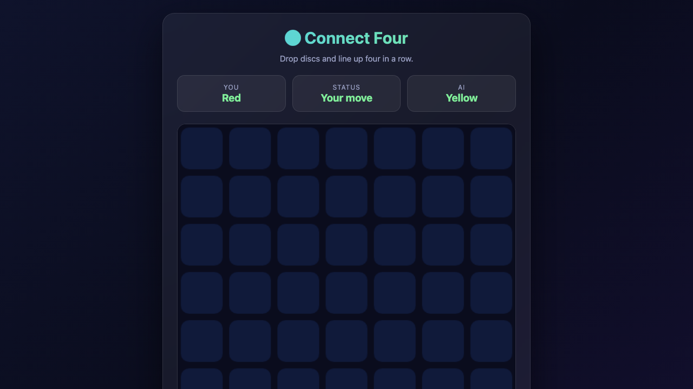

# 🔴 Connect Four

🔴 Connect Four — یک بازی HTML5 مدرن و بدون وابستگی، ساخته‌شده با Canvas و جاوااسکریپت خالص.

🎮 **بازی آنلاین:** https://gamelabz.github.io/html5-game-connect-four/

## 📸 تصویر بازی



## 🎯 درباره بازی

مهره‌ها را در صفحه بینداز، رقیبت را مسدود کن و چهار تا را در یک ردیف برای پیروزی قرار بده.

## 🕹️ کنترل‌ها

- انداختن: کلیک روی ستون
- انتخاب رنگ: دکمه‌ها
- شروع دوباره: R

## ✨ ویژگی‌ها

- تشخیص برد/باخت/مساوی
- بازی مقابل هوش مصنوعی یا دوست
- برجسته‌سازی ردیف برنده

## 🚀 اجرا در محیط محلی

نصبی لازم نیست. بازی را مستقیماً در مرورگر باز کن:

```bash
# روش اول: باز کردن مستقیم فایل
open index.html

# روش دوم: سرویس با یک سرور استاتیک کوچک
npx serve .
```

سپس به نشانی چاپ‌شده مراجعه کن (پیش‌فرض `http://localhost:3000`).

## 🛠️ تکنولوژی

- HTML5 `<canvas>`
- CSS3 (متغیرهای سفارشی، flexbox، گلس‌مورفیسم)
- جاوااسکریپت خالص (ES2020، بدون فریم‌ورک)

## 🤝 مشارکت

از مشارکت استقبال می‌شود! برای همکاری:

1. مخزن را فورک کن.
2. یک شاخه جدید بساز (`git checkout -b feature/my-idea`).
3. تغییرات را کامیت کن (`git commit -m "Add my idea"`).
4. به شاخه پوش کن (`git push origin feature/my-idea`).
5. یک Pull Request باز کن.

لطفاً بازی را بدون وابستگی نگه دار و قبل از ارسال در مرورگر تستش کن.

## 📄 لایسنس

این پروژه تحت [لایسنس MIT](LICENSE) منتشر شده است — یک لایسنس نرم‌افزار آزاد و متن‌باز.

---

بیا با هم چیزی بسازیم 🚀
https://tally.so/r/q4q1L9
